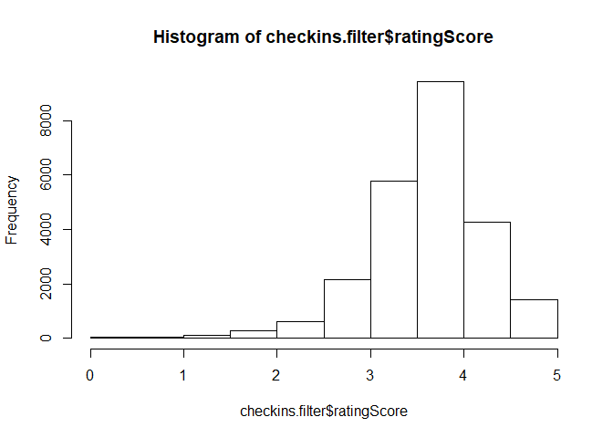
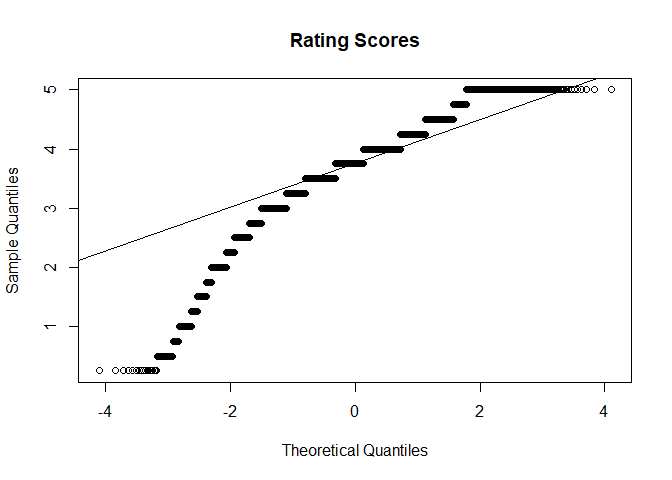

###Question 1
**Is there a bias in the way beer enthusiasts rate a beer at a brewery location and other locations?**

##### State the Problem
Identify if how beer drinker rate beers based on locations.

#### Data Collection
Using the UnTappd API, we downloaded checkins from 7 Breweries in Dallas.  There is a limiation in the data UnTappd releases and only allows for last 300 checkins per beer.

API Web API

```r
fetchUntappd <- function(method = "", qryStr = "", writeFile = FALSE, fileName = ""){
    base_url <- "https://api.untappd.com/v4/"
    key <- paste("client_id=",CLIENT_ID,"&client_secret=",CLIENT_SECRET,sep="")
    requestUrl <- URLencode( paste(base_url, method,"?",key,"&",qryStr,sep="") )
    print(requestUrl)
    response <- GET( requestUrl )
    if(writeFile){
        if( nchar(fileName) == 0 ){
            fileName = paste( gsub( "/", ".", method ), qryStr, "json",sep="." )
        }
        
        if( response$status_code != 200 ){
            fileName <- paste( "errors", fileName, sep="/")
        }
        
        fileName <- paste( "Responses", fileName, sep="/" )
        print(fileName)
        write( content( response, "text"), fileName) 
    }
    response
}

getBrewerySearch <- function(brewery = "", writeFile = FALSE){
    qryStr <- paste( "q=", brewery, sep="" )
    response <- fetchUntappd( "search/brewery", qryStr, writeFile )
    response
    
    # breweries <- fromJSON( content( response,"text" ) )
    # breweries$response$brewery
}

getBreweryCheckIns <- function(breweryId, maxId = 0,  writeFile = FALSE){
    pathStr <- paste("brewery/checkins/",breweryId,sep="")
    qryStr <- ""
    
    if( maxId > 0 ){
        qryStr <- paste("max_id=", maxId, sep="")
    } else {
        # default the fileName maxId to 999999999
        maxId = as.numeric(Sys.time())*1000
    }
        
    response <- fetchUntappd( 
        pathStr, 
        qryStr, 
        writeFile, 
        fileName = paste( "brewery.checkins", breweryId, maxId, "json",sep="." )
    )
}

getBeerCheckIns <- function(beerId, maxId = 0, writeFile = FALSE){
    pathStr <- paste("beer/checkins/",beerId,sep="")
    qryStr <- ""
    if( maxId > 0 ){
        qryStr <- paste("max_id=", maxId, sep="")
    } else {
        # default the fileName maxId to 999999999
        maxId = as.numeric(Sys.time())*1000
    }
    
    response <- fetchUntappd( 
        pathStr, 
        qryStr, 
        writeFile, 
        fileName = paste( "beer.checkins", beerId, maxId, "json",sep="." )
    )
}

readBeerCheckins <- function(checkins = list()){
    items <- checkins$response$checkins$items
    # Loop Through Venue Data since its a list
    venueId <- numeric()
    venueName <- character()
    venueParentCategory <- character()
    venueParentCategoryId <- character()
    venueCategory <- character()
    venueCategoryId <- character()
    venueCategoryIsPrimary <- logical()
    venueCity <- character()
    venueState <- character()
    venueCountry <- character()
    venueLat <- numeric()
    venueLng <- numeric()
    venueFourSquareId <- character()
    venueFourSquareUrl <- character()
    for(i in 1:checkins$response$checkins$count){
        
        if(class(checkins$response$checkins$items[i,]$venue) == "data.frame"){
            venue <- checkins$response$checkins$items[i,]$venue
        } else {
            venue <- checkins$response$checkins$items[i,]$venue[[1]]
        }
        
        if( length(venue) > 0 ){
            venueId[i] <- venue$venue_id
            venueName[i] <- venue$venue_name
            venueParentCategory[i] <- ifelse(!is.null(venue$primary_category),venue$primary_category,NA)
            venueParentCategoryId[i] <- ifelse(!is.null(venue$parent_category_id),venue$parent_category_id,NA)
            if(venue$categories$count > 0){
                if(class(venue$categories$items) == "data.frame"){
                    categories <- venue$categories$items[1,]
                } else {
                    categories <- venue$categories$items[[1]]
                }
                venueCategory[i] <- ifelse(!is.null(categories$category_name),categories$category_name,NA)
                venueCategoryId[i] <- ifelse(!is.null(categories$category_id),categories$category_id,NA)
                venueCategoryIsPrimary[i] <- ifelse(!is.null(categories$is_primary),categories$is_primary,NA)
            } else {
                venueCategory[i] <- NA
                venueCategoryId[i] <- NA
                venueCategoryIsPrimary[i] <- NA
            }
            venueCity[i] <- ifelse(!is.null(venue$location$venue_city),venue$location$venue_city,NA)
            venueState[i] <- ifelse(!is.null(venue$location$venue_state),venue$location$venue_state,NA)
            venueCountry[i] <- ifelse(!is.null(venue$location$venue_country),venue$location$venue_country,NA)
            venueLat[i] <- ifelse(!is.null(venue$location$lat),venue$location$lat,NA)
            venueLng[i] <- ifelse(!is.null(venue$location$lng),venue$location$lng,NA)
            venueFourSquareId[i] <- ifelse(!is.null(venue$foursquare$foursquare_id),venue$foursquare$foursquare_id,NA)
            venueFourSquareUrl[i] <- ifelse(!is.null(venue$foursquare$foursquare_url),venue$foursquare$foursquare_url,NA)
        } else {
            venueId[i] <- NA
            venueName[i] <- NA
            venueParentCategory[i] <- NA
            venueParentCategoryId[i] <- NA
            venueCategory[i] <- NA
            venueCategoryId[i] <- NA
            venueCategoryIsPrimary[i] <- NA
            venueCity[i] <- NA
            venueState[i] <- NA
            venueCountry[i] <- NA
            venueLat[i] <- NA
            venueLng[i] <- NA
            venueFourSquareId[i] <- NA
            venueFourSquareUrl[i] <- NA
        }
    }

    data.frame(
        breweryId = items$brewery$brewery_id,
        breweryName = items$brewery$brewery_name,
        breweryLocation = items$brewery$location$brewery_city,
        breweryState = items$brewery$location$brewery_state,
        breweryLat = items$brewery$location$lat,
        breweryLng = items$brewery$location$lng,
        beerId = items$beer$bid,
        beerName = items$beer$beer_name,
        # beerDescription = items$beer$beer_description,
        beerStyle = items$beer$beer_style,
        beerAbv = items$beer$beer_abv,
        beerIbu = items$beer$beer_ibu, 
        checkinId = items$checkin_id,
        userId = items$user$uid,
        createdAt = items$created_at,
        ratingScore = items$rating_score,
        venueId = venueId,
        venueName = venueName,
        venueParentCategory = venueParentCategory,
        venueParentCategoryId = venueParentCategoryId,
        venueCategory = venueCategory,
        venueCategoryId = venueCategoryId,
        venueCategoryIsPrimary = venueCategoryIsPrimary,
        venueCity = venueCity,
        venueState = venueState,
        venueCountry = venueCountry,
        venueLat = venueLat,
        venueLng = venueLng,
        venueFourSquareId = venueFourSquareId,
        venueFourSquareUrl = venueFourSquareUrl
    )
}
```

Steps we took to download checkin data
1. Identify the brewery ids
    * Peticolas Brewering Company - 13688
    * Nobel Ray Brewing Company - 45011
    * Community Brewing Company - 48372
    * Four Corners - 29815
    * Braindead Brewing - 185850
    * Texas Ale Project - 134551
    * Deep Ellum Brewing Company - 11028
2. Get a base line checkins from brewery (BreweryCheckins.R)
3. Loop through each of the beers checkins from the inital baseline (ParseCheckins.R)
4. Parse all the JSON Objects

Summary of all the elements
<table class="table table-striped table-condensed" style="margin-left: auto; margin-right: auto;">
 <thead>
  <tr>
   <th style="text-align:left;">   </th>
   <th style="text-align:right;"> breweryId </th>
   <th style="text-align:left;"> breweryName </th>
   <th style="text-align:left;"> breweryLocation </th>
   <th style="text-align:left;"> breweryState </th>
   <th style="text-align:right;"> breweryLat </th>
   <th style="text-align:right;"> breweryLng </th>
   <th style="text-align:right;"> beerId </th>
   <th style="text-align:left;"> beerName </th>
   <th style="text-align:left;"> beerStyle </th>
   <th style="text-align:right;"> beerAbv </th>
   <th style="text-align:right;"> beerIbu </th>
   <th style="text-align:right;"> checkinId </th>
   <th style="text-align:right;"> userId </th>
   <th style="text-align:left;"> createdAt </th>
   <th style="text-align:right;"> ratingScore </th>
   <th style="text-align:right;"> venueId </th>
   <th style="text-align:left;"> venueName </th>
   <th style="text-align:left;"> venueParentCategory </th>
   <th style="text-align:left;"> venueParentCategoryId </th>
   <th style="text-align:left;"> venueCategory </th>
   <th style="text-align:left;"> venueCategoryId </th>
   <th style="text-align:left;"> venueCategoryIsPrimary </th>
   <th style="text-align:left;"> venueCity </th>
   <th style="text-align:left;"> venueState </th>
   <th style="text-align:left;"> venueCountry </th>
   <th style="text-align:right;"> venueLat </th>
   <th style="text-align:right;"> venueLng </th>
   <th style="text-align:left;"> venueFourSquareId </th>
   <th style="text-align:left;"> venueFourSquareUrl </th>
   <th style="text-align:right;"> freq </th>
   <th style="text-align:left;"> isBreweryLocation </th>
   <th style="text-align:left;"> beerCategory </th>
  </tr>
 </thead>
<tbody>
  <tr>
   <td style="text-align:left;"> 1 </td>
   <td style="text-align:right;"> 48372 </td>
   <td style="text-align:left;"> Community Beer Company </td>
   <td style="text-align:left;"> Dallas </td>
   <td style="text-align:left;"> TX </td>
   <td style="text-align:right;"> 32.7909 </td>
   <td style="text-align:right;"> -96.8158 </td>
   <td style="text-align:right;"> 1040593 </td>
   <td style="text-align:left;"> Barrel Aged Inspiration </td>
   <td style="text-align:left;"> Belgian Strong Dark Ale </td>
   <td style="text-align:right;"> 10.2 </td>
   <td style="text-align:right;"> 45 </td>
   <td style="text-align:right;"> 627676217 </td>
   <td style="text-align:right;"> 570358 </td>
   <td style="text-align:left;"> Sat, 21 Jul 2018 08:46:41 +0000 </td>
   <td style="text-align:right;"> 4.25 </td>
   <td style="text-align:right;"> 5063418 </td>
   <td style="text-align:left;"> Chesapeake Risinger 6. 7. 8. </td>
   <td style="text-align:left;"> Outdoors &amp; Recreation </td>
   <td style="text-align:left;"> 4d4b7105d754a06377d81259 </td>
   <td style="text-align:left;"> Field </td>
   <td style="text-align:left;"> 4bf58dd8d48988d15f941735 </td>
   <td style="text-align:left;"> TRUE </td>
   <td style="text-align:left;"> Crowley </td>
   <td style="text-align:left;"> TX </td>
   <td style="text-align:left;"> United States </td>
   <td style="text-align:right;"> 32.5958 </td>
   <td style="text-align:right;"> -97.3778 </td>
   <td style="text-align:left;"> 4e2e5543e4cdb5a70d5d72b4 </td>
   <td style="text-align:left;"> http://4sq.com/nOcxoR </td>
   <td style="text-align:right;"> 1 </td>
   <td style="text-align:left;"> N </td>
   <td style="text-align:left;"> Strong Ale </td>
  </tr>
  <tr>
   <td style="text-align:left;"> 5 </td>
   <td style="text-align:right;"> 48372 </td>
   <td style="text-align:left;"> Community Beer Company </td>
   <td style="text-align:left;"> Dallas </td>
   <td style="text-align:left;"> TX </td>
   <td style="text-align:right;"> 32.7909 </td>
   <td style="text-align:right;"> -96.8158 </td>
   <td style="text-align:right;"> 1040593 </td>
   <td style="text-align:left;"> Barrel Aged Inspiration </td>
   <td style="text-align:left;"> Belgian Strong Dark Ale </td>
   <td style="text-align:right;"> 10.2 </td>
   <td style="text-align:right;"> 45 </td>
   <td style="text-align:right;"> 593848377 </td>
   <td style="text-align:right;"> 807661 </td>
   <td style="text-align:left;"> Sat, 05 May 2018 03:39:48 +0000 </td>
   <td style="text-align:right;"> 4.25 </td>
   <td style="text-align:right;"> 4422931 </td>
   <td style="text-align:left;"> Petali Tea Shop </td>
   <td style="text-align:left;"> Shop &amp; Service </td>
   <td style="text-align:left;"> 4d4b7105d754a06378d81259 </td>
   <td style="text-align:left;"> Food &amp; Drink Shop </td>
   <td style="text-align:left;"> 4bf58dd8d48988d1f9941735 </td>
   <td style="text-align:left;"> TRUE </td>
   <td style="text-align:left;"> Granville </td>
   <td style="text-align:left;"> OH </td>
   <td style="text-align:left;"> United States </td>
   <td style="text-align:right;"> 40.0679 </td>
   <td style="text-align:right;"> -82.5177 </td>
   <td style="text-align:left;"> 4c5f02da99ff76b0aac5d09e </td>
   <td style="text-align:left;"> http://4sq.com/cwP0t5 </td>
   <td style="text-align:right;"> 1 </td>
   <td style="text-align:left;"> N </td>
   <td style="text-align:left;"> Strong Ale </td>
  </tr>
  <tr>
   <td style="text-align:left;"> 7 </td>
   <td style="text-align:right;"> 48372 </td>
   <td style="text-align:left;"> Community Beer Company </td>
   <td style="text-align:left;"> Dallas </td>
   <td style="text-align:left;"> TX </td>
   <td style="text-align:right;"> 32.7909 </td>
   <td style="text-align:right;"> -96.8158 </td>
   <td style="text-align:right;"> 1040593 </td>
   <td style="text-align:left;"> Barrel Aged Inspiration </td>
   <td style="text-align:left;"> Belgian Strong Dark Ale </td>
   <td style="text-align:right;"> 10.2 </td>
   <td style="text-align:right;"> 45 </td>
   <td style="text-align:right;"> 585809721 </td>
   <td style="text-align:right;"> 2596230 </td>
   <td style="text-align:left;"> Sat, 14 Apr 2018 23:35:26 +0000 </td>
   <td style="text-align:right;"> 4.00 </td>
   <td style="text-align:right;"> 205940 </td>
   <td style="text-align:left;"> Blissfield, MI </td>
   <td style="text-align:left;"> Outdoors &amp; Recreation </td>
   <td style="text-align:left;"> 4d4b7105d754a06377d81259 </td>
   <td style="text-align:left;"> Village </td>
   <td style="text-align:left;"> 530e33ccbcbc57f1066bbff9 </td>
   <td style="text-align:left;"> TRUE </td>
   <td style="text-align:left;"> Blissfield </td>
   <td style="text-align:left;"> MI </td>
   <td style="text-align:left;"> United States </td>
   <td style="text-align:right;"> 41.8474 </td>
   <td style="text-align:right;"> -83.8668 </td>
   <td style="text-align:left;"> 4c4eded092b6a593cc60a070 </td>
   <td style="text-align:left;"> http://4sq.com/aQseg6 </td>
   <td style="text-align:right;"> 1 </td>
   <td style="text-align:left;"> N </td>
   <td style="text-align:left;"> Strong Ale </td>
  </tr>
  <tr>
   <td style="text-align:left;"> 8 </td>
   <td style="text-align:right;"> 48372 </td>
   <td style="text-align:left;"> Community Beer Company </td>
   <td style="text-align:left;"> Dallas </td>
   <td style="text-align:left;"> TX </td>
   <td style="text-align:right;"> 32.7909 </td>
   <td style="text-align:right;"> -96.8158 </td>
   <td style="text-align:right;"> 1040593 </td>
   <td style="text-align:left;"> Barrel Aged Inspiration </td>
   <td style="text-align:left;"> Belgian Strong Dark Ale </td>
   <td style="text-align:right;"> 10.2 </td>
   <td style="text-align:right;"> 45 </td>
   <td style="text-align:right;"> 585749190 </td>
   <td style="text-align:right;"> 2467214 </td>
   <td style="text-align:left;"> Sat, 14 Apr 2018 22:34:09 +0000 </td>
   <td style="text-align:right;"> 4.00 </td>
   <td style="text-align:right;"> 205940 </td>
   <td style="text-align:left;"> Blissfield, MI </td>
   <td style="text-align:left;"> Outdoors &amp; Recreation </td>
   <td style="text-align:left;"> 4d4b7105d754a06377d81259 </td>
   <td style="text-align:left;"> Village </td>
   <td style="text-align:left;"> 530e33ccbcbc57f1066bbff9 </td>
   <td style="text-align:left;"> TRUE </td>
   <td style="text-align:left;"> Blissfield </td>
   <td style="text-align:left;"> MI </td>
   <td style="text-align:left;"> United States </td>
   <td style="text-align:right;"> 41.8474 </td>
   <td style="text-align:right;"> -83.8668 </td>
   <td style="text-align:left;"> 4c4eded092b6a593cc60a070 </td>
   <td style="text-align:left;"> http://4sq.com/aQseg6 </td>
   <td style="text-align:right;"> 1 </td>
   <td style="text-align:left;"> N </td>
   <td style="text-align:left;"> Strong Ale </td>
  </tr>
  <tr>
   <td style="text-align:left;"> 9 </td>
   <td style="text-align:right;"> 48372 </td>
   <td style="text-align:left;"> Community Beer Company </td>
   <td style="text-align:left;"> Dallas </td>
   <td style="text-align:left;"> TX </td>
   <td style="text-align:right;"> 32.7909 </td>
   <td style="text-align:right;"> -96.8158 </td>
   <td style="text-align:right;"> 1040593 </td>
   <td style="text-align:left;"> Barrel Aged Inspiration </td>
   <td style="text-align:left;"> Belgian Strong Dark Ale </td>
   <td style="text-align:right;"> 10.2 </td>
   <td style="text-align:right;"> 45 </td>
   <td style="text-align:right;"> 582833433 </td>
   <td style="text-align:right;"> 50141 </td>
   <td style="text-align:left;"> Sat, 07 Apr 2018 21:34:05 +0000 </td>
   <td style="text-align:right;"> 4.00 </td>
   <td style="text-align:right;"> 1512050 </td>
   <td style="text-align:left;"> Heritage Park - A Meritage Homes Community </td>
   <td style="text-align:left;"> Residence </td>
   <td style="text-align:left;"> 4e67e38e036454776db1fb3a </td>
   <td style="text-align:left;"> Housing Development </td>
   <td style="text-align:left;"> 4f2a210c4b9023bd5841ed28 </td>
   <td style="text-align:left;"> TRUE </td>
   <td style="text-align:left;"> Sachse </td>
   <td style="text-align:left;"> TX </td>
   <td style="text-align:left;"> United States </td>
   <td style="text-align:right;"> 32.9583 </td>
   <td style="text-align:right;"> -96.5709 </td>
   <td style="text-align:left;"> 50089fb9ebca259d14ab751e </td>
   <td style="text-align:left;"> http://4sq.com/NByRhA </td>
   <td style="text-align:right;"> 1 </td>
   <td style="text-align:left;"> N </td>
   <td style="text-align:left;"> Strong Ale </td>
  </tr>
  <tr>
   <td style="text-align:left;"> 10 </td>
   <td style="text-align:right;"> 48372 </td>
   <td style="text-align:left;"> Community Beer Company </td>
   <td style="text-align:left;"> Dallas </td>
   <td style="text-align:left;"> TX </td>
   <td style="text-align:right;"> 32.7909 </td>
   <td style="text-align:right;"> -96.8158 </td>
   <td style="text-align:right;"> 1040593 </td>
   <td style="text-align:left;"> Barrel Aged Inspiration </td>
   <td style="text-align:left;"> Belgian Strong Dark Ale </td>
   <td style="text-align:right;"> 10.2 </td>
   <td style="text-align:right;"> 45 </td>
   <td style="text-align:right;"> 569259403 </td>
   <td style="text-align:right;"> 570358 </td>
   <td style="text-align:left;"> Mon, 05 Mar 2018 01:40:15 +0000 </td>
   <td style="text-align:right;"> 4.50 </td>
   <td style="text-align:right;"> 5063418 </td>
   <td style="text-align:left;"> Chesapeake Risinger 6. 7. 8. </td>
   <td style="text-align:left;"> Outdoors &amp; Recreation </td>
   <td style="text-align:left;"> 4d4b7105d754a06377d81259 </td>
   <td style="text-align:left;"> Field </td>
   <td style="text-align:left;"> 4bf58dd8d48988d15f941735 </td>
   <td style="text-align:left;"> TRUE </td>
   <td style="text-align:left;"> Crowley </td>
   <td style="text-align:left;"> TX </td>
   <td style="text-align:left;"> United States </td>
   <td style="text-align:right;"> 32.5958 </td>
   <td style="text-align:right;"> -97.3778 </td>
   <td style="text-align:left;"> 4e2e5543e4cdb5a70d5d72b4 </td>
   <td style="text-align:left;"> http://4sq.com/nOcxoR </td>
   <td style="text-align:right;"> 1 </td>
   <td style="text-align:left;"> N </td>
   <td style="text-align:left;"> Strong Ale </td>
  </tr>
</tbody>
</table>

### Test - 2 Sample Test to determine bias in the locations

#### Assumptions

```r
kable( checkins.filter %>% count(breweryName, isBreweryLocation, sort = F) ) %>%
    kable_styling(bootstrap_options = c("striped", "condensed"))
```

<table class="table table-striped table-condensed" style="margin-left: auto; margin-right: auto;">
 <thead>
  <tr>
   <th style="text-align:left;"> breweryName </th>
   <th style="text-align:left;"> isBreweryLocation </th>
   <th style="text-align:right;"> n </th>
  </tr>
 </thead>
<tbody>
  <tr>
   <td style="text-align:left;"> BrainDead Brewing </td>
   <td style="text-align:left;"> N </td>
   <td style="text-align:right;"> 1743 </td>
  </tr>
  <tr>
   <td style="text-align:left;"> BrainDead Brewing </td>
   <td style="text-align:left;"> Y </td>
   <td style="text-align:right;"> 3606 </td>
  </tr>
  <tr>
   <td style="text-align:left;"> Community Beer Company </td>
   <td style="text-align:left;"> N </td>
   <td style="text-align:right;"> 3182 </td>
  </tr>
  <tr>
   <td style="text-align:left;"> Community Beer Company </td>
   <td style="text-align:left;"> Y </td>
   <td style="text-align:right;"> 888 </td>
  </tr>
  <tr>
   <td style="text-align:left;"> Deep Ellum Brewing Company </td>
   <td style="text-align:left;"> N </td>
   <td style="text-align:right;"> 2480 </td>
  </tr>
  <tr>
   <td style="text-align:left;"> Deep Ellum Brewing Company </td>
   <td style="text-align:left;"> Y </td>
   <td style="text-align:right;"> 508 </td>
  </tr>
  <tr>
   <td style="text-align:left;"> Four Corners Brewing Company </td>
   <td style="text-align:left;"> N </td>
   <td style="text-align:right;"> 2167 </td>
  </tr>
  <tr>
   <td style="text-align:left;"> Four Corners Brewing Company </td>
   <td style="text-align:left;"> Y </td>
   <td style="text-align:right;"> 142 </td>
  </tr>
  <tr>
   <td style="text-align:left;"> Noble Rey Brewing Company </td>
   <td style="text-align:left;"> N </td>
   <td style="text-align:right;"> 2329 </td>
  </tr>
  <tr>
   <td style="text-align:left;"> Noble Rey Brewing Company </td>
   <td style="text-align:left;"> Y </td>
   <td style="text-align:right;"> 459 </td>
  </tr>
  <tr>
   <td style="text-align:left;"> Peticolas Brewing Company </td>
   <td style="text-align:left;"> N </td>
   <td style="text-align:right;"> 3208 </td>
  </tr>
  <tr>
   <td style="text-align:left;"> Peticolas Brewing Company </td>
   <td style="text-align:left;"> Y </td>
   <td style="text-align:right;"> 849 </td>
  </tr>
  <tr>
   <td style="text-align:left;"> Texas Ale Project </td>
   <td style="text-align:left;"> N </td>
   <td style="text-align:right;"> 2032 </td>
  </tr>
  <tr>
   <td style="text-align:left;"> Texas Ale Project </td>
   <td style="text-align:left;"> Y </td>
   <td style="text-align:right;"> 540 </td>
  </tr>
</tbody>
</table>

```r
hist(checkins.filter$ratingScore)
```

<!-- -->

```r
qqnorm(checkins.filter$ratingScore, main='Rating Scores')
qqline(checkins.filter$ratingScore)
```

<!-- -->

Visual evidence shows the data has a right skewness, but given our large sample size we expect central limit therom to be robust from violations in the data.  The data does show the ame user rating the beer multiple times in different locations.  In order to assume indpendent in our data we will average users rating per beer by either being at the brewery or not at the brewery (isBreweryLocation).  We will also exclude beers with less than 10 checkins per location from our population.


```r
checkins.filter.independent <- checkins.filter %>% 
    group_by(breweryId, breweryName, userId, beerId, isBreweryLocation) %>% 
    summarise(
        iRatingScore = mean(ratingScore)
    )

checkins.filter.independent <- as.data.frame(checkins.filter.independent)
# checkins.filter.independent %>% count(breweryId, isBreweryLocation, sort = TRUE)
distinctBeerIds <- plyr::count(checkins.filter.independent, "beerId")
names(distinctBeerIds) <- c("beerId","totalCheckins")
checkins.filter.independent <- inner_join(checkins.filter.independent, distinctBeerIds, by = c("beerId" = "beerId") )

kable( checkins.filter.independent[checkins.filter.independent$totalCheckins>=10,] %>% count(breweryName, isBreweryLocation, sort = F) ) %>%
    kable_styling(bootstrap_options = c("striped", "condensed"))
```

<table class="table table-striped table-condensed" style="margin-left: auto; margin-right: auto;">
 <thead>
  <tr>
   <th style="text-align:left;"> breweryName </th>
   <th style="text-align:left;"> isBreweryLocation </th>
   <th style="text-align:right;"> n </th>
  </tr>
 </thead>
<tbody>
  <tr>
   <td style="text-align:left;"> BrainDead Brewing </td>
   <td style="text-align:left;"> N </td>
   <td style="text-align:right;"> 1694 </td>
  </tr>
  <tr>
   <td style="text-align:left;"> BrainDead Brewing </td>
   <td style="text-align:left;"> Y </td>
   <td style="text-align:right;"> 3511 </td>
  </tr>
  <tr>
   <td style="text-align:left;"> Community Beer Company </td>
   <td style="text-align:left;"> N </td>
   <td style="text-align:right;"> 3050 </td>
  </tr>
  <tr>
   <td style="text-align:left;"> Community Beer Company </td>
   <td style="text-align:left;"> Y </td>
   <td style="text-align:right;"> 872 </td>
  </tr>
  <tr>
   <td style="text-align:left;"> Deep Ellum Brewing Company </td>
   <td style="text-align:left;"> N </td>
   <td style="text-align:right;"> 2362 </td>
  </tr>
  <tr>
   <td style="text-align:left;"> Deep Ellum Brewing Company </td>
   <td style="text-align:left;"> Y </td>
   <td style="text-align:right;"> 505 </td>
  </tr>
  <tr>
   <td style="text-align:left;"> Four Corners Brewing Company </td>
   <td style="text-align:left;"> N </td>
   <td style="text-align:right;"> 2050 </td>
  </tr>
  <tr>
   <td style="text-align:left;"> Four Corners Brewing Company </td>
   <td style="text-align:left;"> Y </td>
   <td style="text-align:right;"> 118 </td>
  </tr>
  <tr>
   <td style="text-align:left;"> Noble Rey Brewing Company </td>
   <td style="text-align:left;"> N </td>
   <td style="text-align:right;"> 2241 </td>
  </tr>
  <tr>
   <td style="text-align:left;"> Noble Rey Brewing Company </td>
   <td style="text-align:left;"> Y </td>
   <td style="text-align:right;"> 449 </td>
  </tr>
  <tr>
   <td style="text-align:left;"> Peticolas Brewing Company </td>
   <td style="text-align:left;"> N </td>
   <td style="text-align:right;"> 3091 </td>
  </tr>
  <tr>
   <td style="text-align:left;"> Peticolas Brewing Company </td>
   <td style="text-align:left;"> Y </td>
   <td style="text-align:right;"> 820 </td>
  </tr>
  <tr>
   <td style="text-align:left;"> Texas Ale Project </td>
   <td style="text-align:left;"> N </td>
   <td style="text-align:right;"> 1946 </td>
  </tr>
  <tr>
   <td style="text-align:left;"> Texas Ale Project </td>
   <td style="text-align:left;"> Y </td>
   <td style="text-align:right;"> 528 </td>
  </tr>
</tbody>
</table>

#### Hyptohesis Test
Null Hyptohesis: µ ratings at the brewery = µ ratings not at the brewery
Alternative Hyptohesis: µ ratings at the brewery > µ ratings not at the brewery


```r
breweryIds <- unique(checkins.filter.independent[,1:2])
breweries <- data.frame(
    breweryName = character(),
    t.value = numeric(),
    p.value = numeric(),
    Brewery.Rating = numeric(),
    Not.At.Brewery.Rating = numeric(),
    avg.difference = numeric(),
    conf.int.lwr = numeric(),
    conf.int.upr = numeric()
)
for(i in 1:length(breweryIds$breweryId)){
    test.data <- checkins.filter.independent[ checkins.filter.independent$totalCheckins >= 10 & checkins.filter.independent$breweryId==breweryIds[i,1],]
    test.data <- test.data[order(test.data$isBreweryLocation, decreasing = T),]
    ttest <- t.test(
        iRatingScore ~ isBreweryLocation,
        data=test.data,
        var.equal=T, 
        conf.level=0.95,
        alternative = "less"
    )
    ttest.conf.int <- t.test(
        iRatingScore ~ isBreweryLocation,
        data=test.data,
        var.equal=T, 
        conf.level=0.90,
        alternative = "two.sided"
    )
    
    breweries <- rbind( breweries, data.frame(
        breweryName = c(as.character(test.data[1,]$breweryName)),
        t.value = c(ttest$statistic),
        p.value = c(round(ttest$p.value,5)),
        Brewery.Rating = c(ttest$estimate[2]),
        Not.At.Brewery.Rating = c(ttest$estimate[1]),
        avg.difference = c(ttest$estimate[2] - ttest$estimate[1]),
        conf.int.lwr = c(ttest.conf.int$conf.int[2]*-1),
        conf.int.upr = c(ttest.conf.int$conf.int[1]*-1)
    ))
}
kable( breweries ) %>%
    kable_styling(bootstrap_options = c("striped", "condensed"))
```

<table class="table table-striped table-condensed" style="margin-left: auto; margin-right: auto;">
 <thead>
  <tr>
   <th style="text-align:left;">   </th>
   <th style="text-align:left;"> breweryName </th>
   <th style="text-align:right;"> t.value </th>
   <th style="text-align:right;"> p.value </th>
   <th style="text-align:right;"> Brewery.Rating </th>
   <th style="text-align:right;"> Not.At.Brewery.Rating </th>
   <th style="text-align:right;"> avg.difference </th>
   <th style="text-align:right;"> conf.int.lwr </th>
   <th style="text-align:right;"> conf.int.upr </th>
  </tr>
 </thead>
<tbody>
  <tr>
   <td style="text-align:left;"> t </td>
   <td style="text-align:left;"> Deep Ellum Brewing Company </td>
   <td style="text-align:right;"> -1.3108814 </td>
   <td style="text-align:right;"> 0.09500 </td>
   <td style="text-align:right;"> 3.769554 </td>
   <td style="text-align:right;"> 3.732104 </td>
   <td style="text-align:right;"> 0.0374507 </td>
   <td style="text-align:right;"> -0.0095565 </td>
   <td style="text-align:right;"> 0.0844578 </td>
  </tr>
  <tr>
   <td style="text-align:left;"> t1 </td>
   <td style="text-align:left;"> Peticolas Brewing Company </td>
   <td style="text-align:right;"> -1.8811000 </td>
   <td style="text-align:right;"> 0.03002 </td>
   <td style="text-align:right;"> 3.903049 </td>
   <td style="text-align:right;"> 3.859269 </td>
   <td style="text-align:right;"> 0.0437799 </td>
   <td style="text-align:right;"> 0.0054892 </td>
   <td style="text-align:right;"> 0.0820706 </td>
  </tr>
  <tr>
   <td style="text-align:left;"> t2 </td>
   <td style="text-align:left;"> Four Corners Brewing Company </td>
   <td style="text-align:right;"> 0.8100099 </td>
   <td style="text-align:right;"> 0.79099 </td>
   <td style="text-align:right;"> 3.568960 </td>
   <td style="text-align:right;"> 3.617785 </td>
   <td style="text-align:right;"> -0.0488248 </td>
   <td style="text-align:right;"> -0.1480136 </td>
   <td style="text-align:right;"> 0.0503641 </td>
  </tr>
  <tr>
   <td style="text-align:left;"> t3 </td>
   <td style="text-align:left;"> Noble Rey Brewing Company </td>
   <td style="text-align:right;"> -2.2602626 </td>
   <td style="text-align:right;"> 0.01194 </td>
   <td style="text-align:right;"> 3.665924 </td>
   <td style="text-align:right;"> 3.594751 </td>
   <td style="text-align:right;"> 0.0711730 </td>
   <td style="text-align:right;"> 0.0193607 </td>
   <td style="text-align:right;"> 0.1229854 </td>
  </tr>
  <tr>
   <td style="text-align:left;"> t4 </td>
   <td style="text-align:left;"> Community Beer Company </td>
   <td style="text-align:right;"> -4.4983794 </td>
   <td style="text-align:right;"> 0.00000 </td>
   <td style="text-align:right;"> 3.852924 </td>
   <td style="text-align:right;"> 3.744064 </td>
   <td style="text-align:right;"> 0.1088601 </td>
   <td style="text-align:right;"> 0.0690455 </td>
   <td style="text-align:right;"> 0.1486747 </td>
  </tr>
  <tr>
   <td style="text-align:left;"> t5 </td>
   <td style="text-align:left;"> Texas Ale Project </td>
   <td style="text-align:right;"> -0.3388153 </td>
   <td style="text-align:right;"> 0.36739 </td>
   <td style="text-align:right;"> 3.756865 </td>
   <td style="text-align:right;"> 3.746478 </td>
   <td style="text-align:right;"> 0.0103877 </td>
   <td style="text-align:right;"> -0.0400606 </td>
   <td style="text-align:right;"> 0.0608361 </td>
  </tr>
  <tr>
   <td style="text-align:left;"> t6 </td>
   <td style="text-align:left;"> BrainDead Brewing </td>
   <td style="text-align:right;"> -0.6759795 </td>
   <td style="text-align:right;"> 0.24954 </td>
   <td style="text-align:right;"> 3.748606 </td>
   <td style="text-align:right;"> 3.735537 </td>
   <td style="text-align:right;"> 0.0130684 </td>
   <td style="text-align:right;"> -0.0187364 </td>
   <td style="text-align:right;"> 0.0448732 </td>
  </tr>
</tbody>
</table>

#### Conclusion
At a significant level of .05, Peticolas, Nobel Rey, and Community mean rating is greater while consumed at the brewery versus not at the brewry.  A 95% confident intervals are listed above.

This was an obersational study and no inference can be inferred from the study.  The data was consumed from a week worth of 300 checkins and not a random sample.  We can only inferre the outcome from this population.
